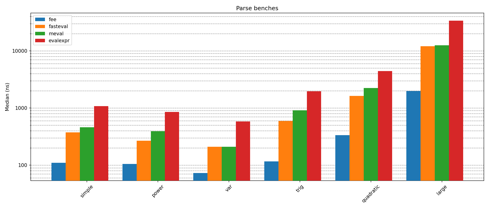

# Fast Expression Evaluators

[](https://crates.io/crates/fee)
[](https://docs.rs/fee)

`fee` is a fast and flexible library for evaluating mathematical
expressions from strings. It focuses on **runtime performance**
while keeping parsing simple and efficient.

This crate was born to power scientific and engineering software
where expressions cannot be hardcoded:
- The source code may be unavailable to recompile.
- Or you may want to ship closed/private tools with configurable formulas.

Contributions, ideas, bug reports and recommendations are welcome.

## Usage

First step is add the dependency to your Cargo.toml.

```toml
[dependencies]
fee = { version = "0.2.0" }
```

The following code shows the default use case

```rust
use fee::{prelude::*, DefaultResolver};

fn main()
{
    let expr = "max((2 + 4) * 6 / (p1 + 2), sqrt(p0^2 + p1^2)) + abs(-2)";

    let mut var_resolver = DefaultResolver::empty();
    var_resolver.insert("p0", 10.0);
    var_resolver.insert("p1", 4.0);

    let mut fn_resolver = DefaultResolver::empty();
    fn_resolver.insert("abs", ExprFn::new(abs));

    let context = Context::new(var_resolver, fn_resolver);
    let mut stack = Vec::with_capacity(10);

    let expr = Expr::compile(expr, &context).unwrap();

    let result = expr.eval(&context, &mut stack).unwrap();
    assert_eq!(result, 8.0);
}

fn abs(x: &[f64]) -> f64 {
   x[0].abs()
}
```

## Resolvers

The resolvers are the objects that give meaning to the variables and
functions used in an expression. They can be freely combined in a
`Context` depending on your needs.

The current available resolvers are:

- `DefaultResolver` — No size or naming restrictions, but slower than specialized resolvers.
- `IndexedResolver` — No size restrictions, but requires specific naming patterns. Very fast.
- `SmallResolver` — Restricted size, but allows arbitrary names with good performance.
- `ConstantResolver` — Always resolves to the same value; offers the best performance.
- `EmptyResolver` — Always resolves to `None`; useful for expressions without variables or functions.

To learn more about their pros and cons read each struct's documentation.

## Features

### Supported Expressions

- Binary operators: +, \*, -, /, ^, %
- Unitary operators: -
- Variables
- Functions with no limit in the number of arguments.
- f64 operations.

Example of a valid expression:

```
2 * 4 - max(abs(p0 + (-p3) * 25), p3 * 45, 0) + sqrt(5)
```

### Smart compilation

One of the goals of this library is provide a simple but powerful API. To archive
this, the `Expr::compile()` method, depending on the context provided and thanks to
Rust’s type system, it automatically picks the best `Expr<T>` specialization for
your `Context`. You only need to choose the right resolvers, and `fee` will compile
to the most efficient form at **compile time**.

The different types of `Expr` are:

- `RPN (Expr<Rpn>)`: Default and the slowest expression variant.
- `Indexed Var RPN (Expr<IVRpn>)`: Compiled expression with indexed variable resolver.
- `Indexed Fn RPN (Expr<IFRpn>)`: Compiled expression with indexed function resolver.
- `Indexed RPN (Expr<IRpn>)`: Compiled expression with indexed variable and function resolver.
- `Locked RPN (Expr<LRpn>)`: Compiled expression with locked context.

## Locking

The context has a method called `lock()` that allows the context to lock
the resolvers it holds. Locking implies that the resolvers will no
longer be able to grow in size, avoiding any further reallocations. This enables
the use of pointers to get and set the resolver's items values. Using a locked
context, the expression can be compiled to a more optimized form, reducing the
number of operations required to evaluate the expression in exchange of not being
able to add new items to the resolvers.

When building this type of expression, the context should be able to resolve
the expression's variables and functions at compile time instead of eval time.

```Rust
let context = Context::new(var_resolver, fn_resolver);
let mut stack = Vec::with_capacity(10);

let expr = Expr::compile("abs(2 / p1) + abs(-2)", &context).unwrap().lock();
```

## Benchmarking

To execute the library benches use the following script, where `$CORES` is the
CPU core range to be used. It is recommended to use the best available cores
(isolated cores if posible), with turbo disabled and a fixed frequency to reduce
noise as much as possible.

```bash
CORES=0
taskset -c $CORES cargo bench internal
```

The following script executes the benches related to comparations with
other similar libraries available in crates.io.

```bash
CORES=0
taskset -c $CORES cargo bench cmp
```

- Simple Expr -> 3 * 3 - 3 / 3
- Power Expr -> 2 ^ 3 ^ 4
- Var Expr -> x0 * 2
- Trig Expr -> s0(x0) + c0(x0)
- Quadratic Expr -> (-x2 + (x2^2 - 4*x0*x1)^0.5) / (2*x0)
- Large Expr -> ((((87))) - 73) + (97 + (((15 / 55 * ((31)) + 35))) + (15 - (9)) - (39 / 26) / 20 / 91 + 27 / (33 * 26 + 28 - (7) / 10 + 66 * 6) + 60 / 35 - ((29) - (69) / 44 / (92)) / (89) + 2 + 87 / 47 * ((2)) * 83 / 98 * 42 / (((67)) * ((97))) / (34 / 89 + 77) - 29 + 70 * (20)) + ((((((92))) + 23 * (98) / (95) + (((99) * (41))) + (5 + 41) + 10) - (36) / (6 + 80 * 52 + (90))))





## Additional Resources

- [Roadmap](ROADMAP.md)
- [Changelog](CHANGELOG.md)
- [Contributing](CONTRIBUTING.md)
